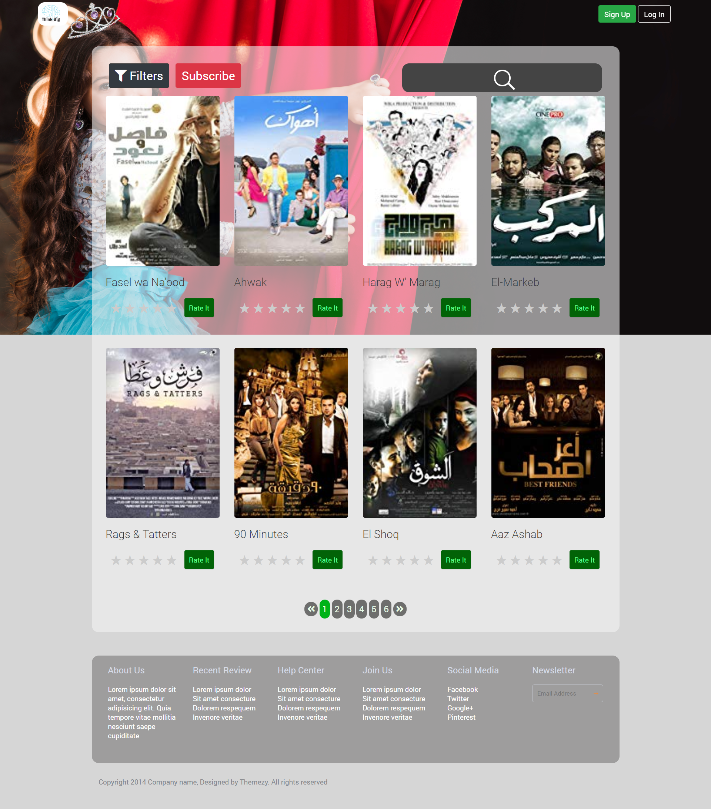

# what have been accomplished
This repository contains an modified version of the assignment for the summer internship.

## Features supported by the front end 
As can be seen from the image below the features included are: 
 - Header Section Controls
   - there is a log in button so the user can identify him self.
   - and there is a sign up button so if he isn't register yet, he can have an account.
 - Movies Section Controls 
   - Visitor will enter his email address. In return our WebServer will send an authentication token to the email address provided
   - Visitor will verify their email address by entering the received authentication token 
   - Visitor can subscribe/unsubscribe to our service through a button which will show the popup (same button, which will change based on the user status, i.e. subscribed or not)
  
   - Visitor can search for a movie (right search panel)
   - Visitor can filter the movies by year or type (pop up lists)
   - This has been implemented as checkboxes in a pop up menu, to allow the visitor to check multiple types and years. 

   - Visitor can get the next batch of movies. We are not including that button in the page, you decide where is best place to have it 
   - For each movie
     - Visitor can provide a rating 
     - Visitor can ask us to provide him "his learned rating" (the rate it button)

